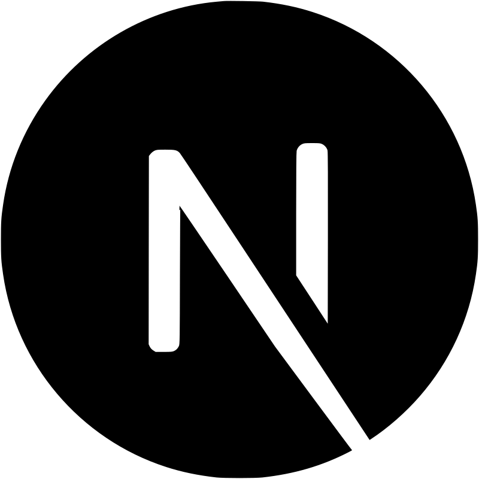
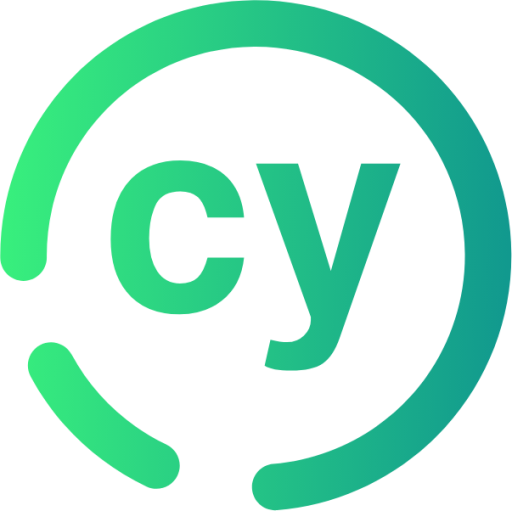
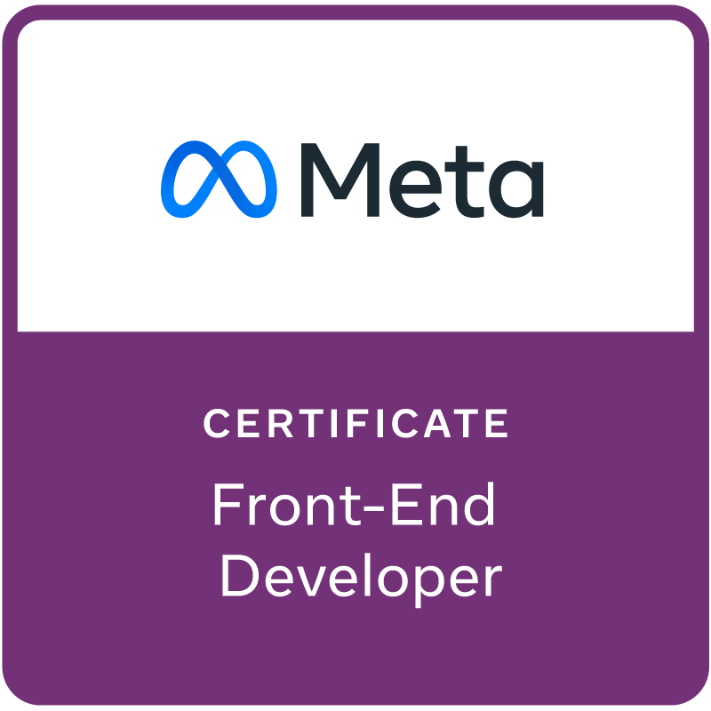
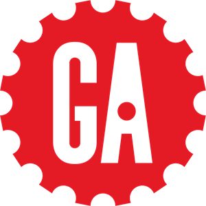
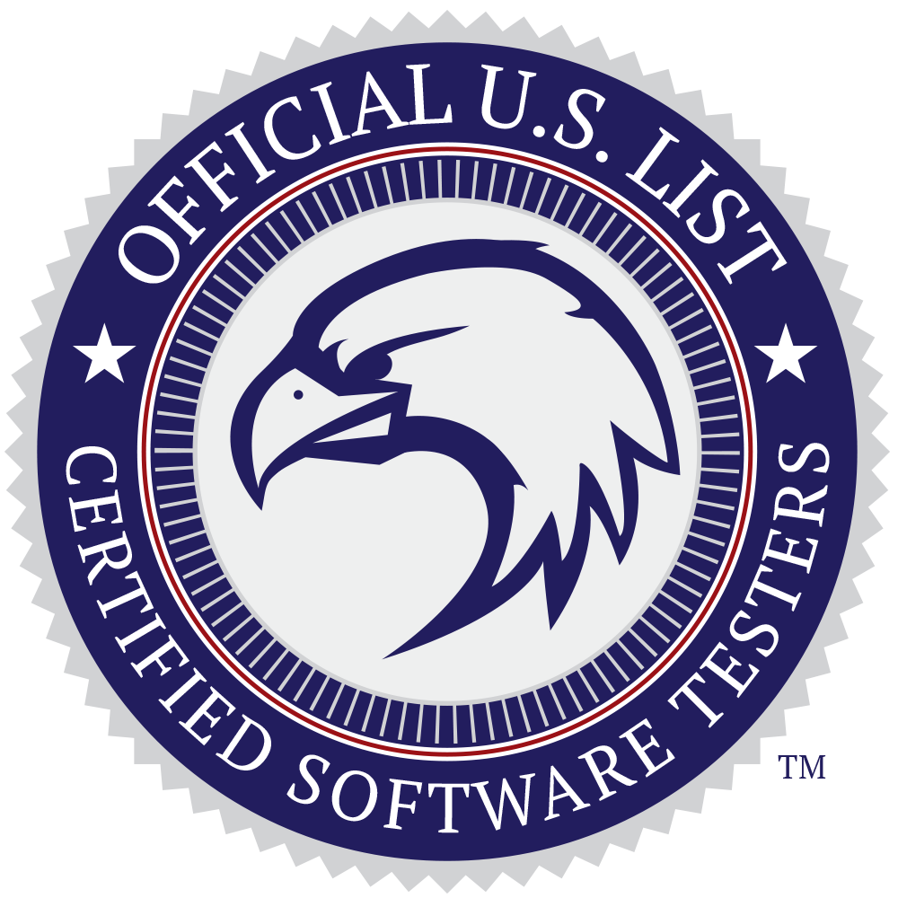

## About Me:

Software Developer building Single Page Applications (SPA)s, 4+ years of experience with JavaScript Frameworks, currently
exploring full-time opportunities in Software Development. Possess 5+ years of experience in Software Quality, advocating
and coaching teams on high-quality and secure code best practices. Holds an educational background in Electrical Engineering and Cybersecurity.

## My Skills 🚀

## Certifications 🚀

## Currently Learning 🚀

### :trophy: Git Profile Trophies

<!--

--->
<<<<<<< HEAD

=======

>>>>>>> f56ae42 (update certs)

<!--
## Connect with Me 🌐

  <a href="https://github.com/shirinmjr" target="_blank" rel="noreferrer">
    <picture>
      <source media="(prefers-color-scheme: dark)" srcset="https://raw.githubusercontent.com/danielcranney/readme-generator/main/public/icons/socials/github-dark.svg" />
      <source media="(prefers-color-scheme: light)" srcset="https://raw.githubusercontent.com/danielcranney/readme-generator/main/public/icons/socials/github.svg" />
      
    </picture>
  </a>&nbsp;&nbsp;
 &nbsp;&nbsp;&nbsp;&nbsp;

<h3 align="left">Languages and Tools:</h3>

**shirinmjr/shirinmjr** is a ✨ _special_ ✨ repository because its `README.md` (this file) appears on your GitHub profile.

Here are some ideas to get you started:

- 🔭 I’m currently working on ...
- 🌱 I’m currently learning ...
- 👯 I’m looking to collaborate on ...
- 🤔 I’m looking for help with ...
- 💬 Ask me about ...
- 📫 How to reach me: ...
- 😄 Pronouns: ...
- ⚡ Fun fact: ...
-->
