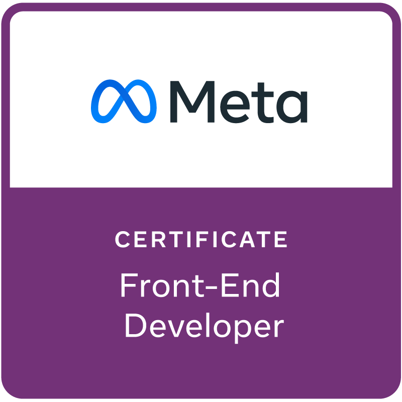
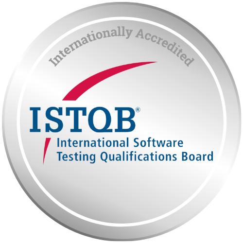
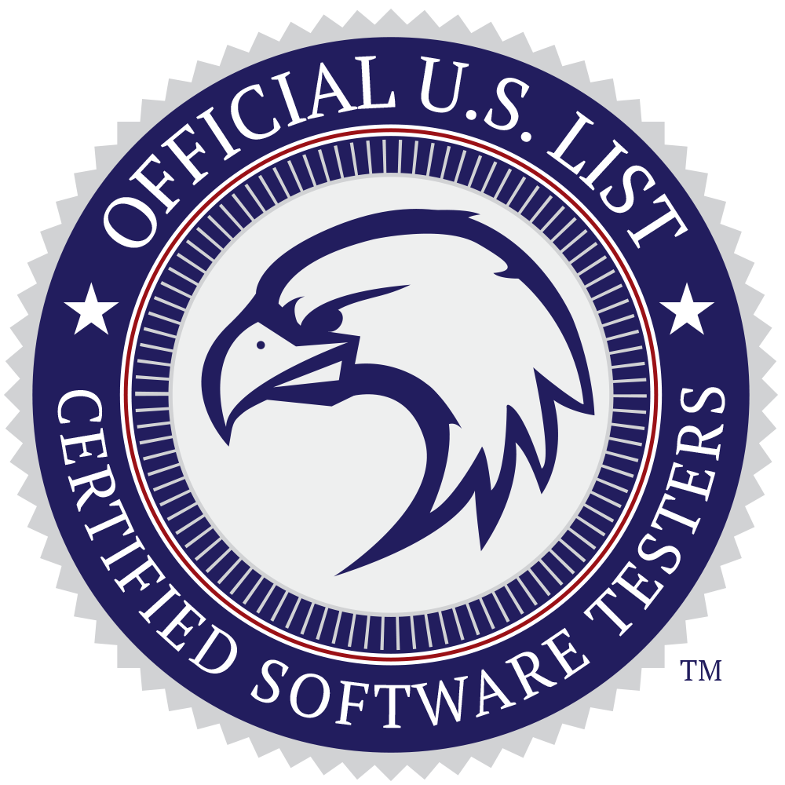

<h1 align="center">Shirin Mohajer</h1>

<h3 align="center">Full-Stack Engineer &nbsp;|&nbsp; AI-Enabled Products &nbsp;|&nbsp; Founder &amp; Builder</h3>

Ex-Oracle &nbsp;·&nbsp; Ex-SAIC &nbsp;·&nbsp; Ex-FINRA

  <a href="https://shirinmjr.github.io">Portfolio</a> &nbsp;·&nbsp;
  <a href="https://www.linkedin.com/in/shirinmohajer/">LinkedIn</a> &nbsp;·&nbsp;
  <a href="https://github.com/shirinmjr">GitHub</a>

---

## About Me

Full-stack engineer with 8+ years of experience building secure, scalable web applications and AI-enabled workflow tools. I care about clean code, solid testing, and shipping products people actually use. Currently at Tanaq, and building [Home Agent Guru](https://homeagentguru.com), an AI-powered home-buyer app, on the side.

## My Skills 🚀

**Languages**

  

**Frontend**

  

**Backend and Databases**

  

**Cloud and DevOps**

  

**Testing, APIs and Tools**

  

Also: Oracle JET, Drizzle ORM, Cosmos DB, Databricks, Okta, OAuth 2.0 / OIDC, RBAC, Zod, Section 508, TDD, Agile/Scrum.

## Certifications 🚀

## Honors and Communities

- Code The Dream Volunteer program | Volunteer coach and Instructor | 3/2024 – Present
- The National Society of Leadership and Success (NSLS) | 12/2023 – Present
- Honor Society of Phi Kappa Phi | Chapter 022UC | 04/2019 – Present
- SURGE (Equal Opportunity for Underrepresented and Minority Groups) | 11/2021 – 12/2022
- Third Place, FINRA annual Cybersecurity Hackathon | 01/2018
- Paajaf Foundation | Volunteer Web Developer | 03/2017 – 01/2018

## Connect with Me 🌐

<a href="https://github.com/shirinmjr" target="_blank" rel="noreferrer"><picture><source media="(prefers-color-scheme: dark)" srcset="https://raw.githubusercontent.com/danielcranney/readme-generator/main/public/icons/socials/github-dark.svg" /><source media="(prefers-color-scheme: light)" srcset="https://raw.githubusercontent.com/danielcranney/readme-generator/main/public/icons/socials/github.svg" /></picture></a>&nbsp;&nbsp;&nbsp;&nbsp;&nbsp;&nbsp;

