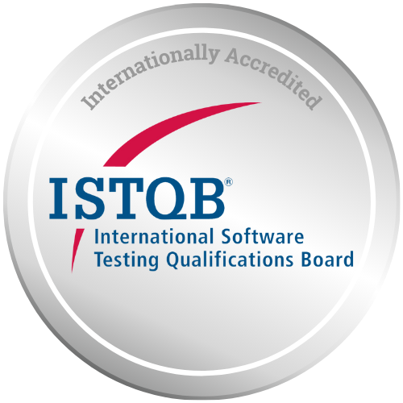

## About Me:

Full-Stack Software Engineer @ Tanaq | Love for clean code | Building Community

Ex-Oracle | Ex-SAIC | Ex-FINRA

## My Skills 🚀

  

## Certifications 🚀

    

# Honors and Communities

Code The Dream Volunteer program | Volunteer coach and Instructor. | 3/2024 – Present

The National Society of Leadership and Success (NSLS) | 12/2023 – Present

Active member of The Honor Society of Phi Kappa Phi | Chapter 022UC 04/2019 – Present

SURGE (Equal Opportunity for Underrepresented and Minority Groups). | 11/2021 – 12/2022 

Third Place on FINRA annual Cybersecurity Hackathon. | 01/2018

Paajaf Foundation | Volunteer Web Developer | 03/2017 – 01/ 2018

<!--

--->

<!--
## Connect with Me 🌐

  <a href="https://github.com/shirinmjr" target="_blank" rel="noreferrer">
    <picture>
      <source media="(prefers-color-scheme: dark)" srcset="https://raw.githubusercontent.com/danielcranney/readme-generator/main/public/icons/socials/github-dark.svg" />
      <source media="(prefers-color-scheme: light)" srcset="https://raw.githubusercontent.com/danielcranney/readme-generator/main/public/icons/socials/github.svg" />
      
    </picture>
  </a>&nbsp;&nbsp;
 &nbsp;&nbsp;&nbsp;&nbsp;

<h3 align="left">Languages and Tools:</h3>

**shirinmjr/shirinmjr** is a ✨ _special_ ✨ repository because its `README.md` (this file) appears on your GitHub profile.

Here are some ideas to get you started:

- 🔭 I’m currently working on ...
- 🌱 I’m currently learning ...
- 👯 I’m looking to collaborate on ...
- 🤔 I’m looking for help with ...
- 💬 Ask me about ...
- 📫 How to reach me: ...
- 😄 Pronouns: ...
- ⚡ Fun fact: ...
-->
